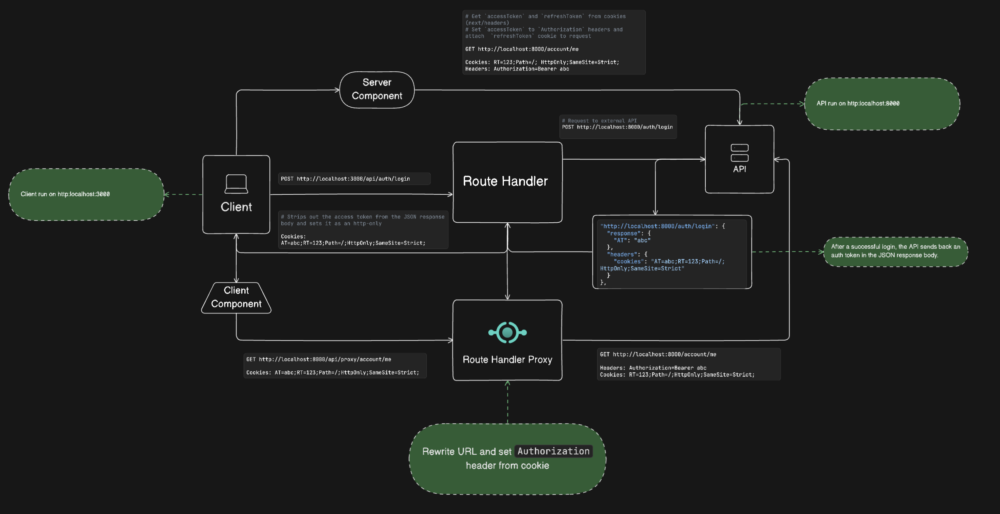

# Next Authentication with JWT

## Login

### Headers and Response from the `External API`

#### Headers

```http
HTTP/1.1 200 OK
Content-Type: application/json
Set-Cookie:refreshToken=eyJhbGci; Max-Age=3600; Path=/; Expires=Sun, 12 May 2024 04:37:24 GMT; HttpOnly; SameSite=Lax
```

#### Response

```json
{
 "message": "Login successful",
 "data": {
  "accessToken" : "eyJlbWFp",
  }
}
```

### From the client component

- Make a POST request to the `Route Handler` with the user's credentials (email and password) and set access token, refresh token in the `cookies` using `next/headers` or `NextResponse.json()`.

```typescript
export async function POST(request: Request) {
 const body = await request.json();

 const res = await fetch(`${process.env.NEXT_PUBLIC_API_URL}/auth/login`, {
  method: "POST",
  body: JSON.stringify(body),
  credentials: "include",
  headers: {
   "Content-Type": "application/json",
  },
 });

 const json = await res.json();
 if (!res.ok) {
  return NextResponse.json(
   {
    message: json.message,
   },
   {
    status: res.status,
   },
  );
 }

 const cookiesFromResponse = res.headers.getSetCookie();

 const cookieStore = cookies();

 cookieStore.set("accessToken", json.data.accessToken, {
  httpOnly: true,
  secure: true,
  sameSite: "strict",
  path: "/",
 });

 return NextResponse.json(json, {
  headers: {
   "Set-Cookie": cookiesFromResponse.join(", "),
   credentials: "include",
  },
 });
}
```

Note:

- Why we don't make a POST request directly to the `External API` from the client component?
  - As the `accessToken` is returned in the response body while the `refreshToken` is returned in the `Cookies` header, it is not possible to set `accessToken` in the `cookies` using `next/headers` or `NextResponse.json()`.

### From the server component

- Only use `Server Action`.
- Validate the user's credentials(email and password).
- Make a POST request(`External Server` or `API Handler` like `Client component`) with the user's credentialsand set access token, refresh token in the `cookies` using `next/headers`

```typescript
const login = async (formData: FormData) => {
  "use server";

  const { email, password } = Object.fromEntries(formData.entries());
  const body = JSON.stringify({
   email,
   password,
  });
  const headers = {
   "Content-Type": "application/json",
  };
  const res = await fetch(`${process.env.NEXT_PUBLIC_URL}/api/auth/login`, {
   credentials: "include",
   method: "POST",
   headers,
   body,
  });

  const json = await res.json();

  const refreshToken =
   res.headers.get("set-cookie")?.split(";")[0].split("=")[1] || "";

  const cookieStore = cookies();

  cookieStore.set("accessToken", json.data.accessToken, {
   httpOnly: true,
   secure: true,
   sameSite: "strict",
   path: "/",
  });

  cookieStore.set("refreshToken", refreshToken, {
   httpOnly: true,
   secure: true,
   sameSite: "strict",
   path: "/",
  });

  return json;
 };
```

Note:

- If you send a POST request to the API Handler and return `accessToken` in the `cookies` by using `next/headers` or `NextResponse.json()`, and the response from the External API to Server Action, the cookies won't be set in the browser. To resolve this issue, you need to set the `accessToken` in the `cookies` using `next/headers` or `NextResponse.json()` in the Server Action as you did before.

## Logout

### From the client component

- Make a POST request to the `Route Handler` and remove the `accessToken` and `refreshToken` from the `cookies` using `next/headers` or `NextResponse.json()`.

API (/api/auth/logout)

```typescript
import { HttpError } from "@/lib/fetch";
import { cookies } from "next/headers";
import { NextResponse } from "next/server";

export async function DELETE(req: Request) {
 try {
  const headers = req.headers;
  const res = await fetch(`${process.env.NEXT_PUBLIC_API_URL}/auth/logout`, {
   method: "DELETE",
   headers,
  });
  const json = await res.json();
  if (!res.ok)
   throw new HttpError({
    error: json.error,
    message: json.message,
    statusCode: res.status,
   });

  const cookieStore = cookies();

  cookieStore.delete("accessToken");
  cookieStore.delete("refreshToken");

  return NextResponse.json(json);
 } catch (error) {
  return Promise.reject(error);
 }
}
```

### From the server component

- Only use `Server Action`.
- Make a POST request(`External Server`) and remove the `accessToken` and `refreshToken` from the `cookies` using `next/headers`.

```ts
const logoutAction = async () => {
  "use server";

  const headers = {
   "Content-Type": "application/json",
  };
  const res = await fetch(`${process.env.NEXT_PUBLIC_API_URL}/auth/logout`, {
   credentials: "include",
   method: "DELETE",
   headers,
  });

  const json = await res.json();

  const cookieStore = cookies();

  cookieStore.delete("accessToken");
  cookieStore.delete("refreshToken");

  return json;
 };
```

## Refresh Token

- Create `RefreshTokenMachine` to refresh the `accessToken` using the `refreshToken`.
- Set timeout to refresh the `accessToken` before it expires.
- Make a POST request to the `Route Handler Proxy` with the `refreshToken` and set the new `accessToken` in the `cookies` using `next/headers` or `NextResponse.json()`.

refresh-token-machine.tsx

```tsx
"use client";

import dayjs from "dayjs";
import { jwtDecode } from "jwt-decode";
import { useRouter } from "next/navigation";
import { useEffect, useRef, useState } from "react";
import { useAuthContext } from "../auth/context";

export default function RefreshTokenMachine() {
 const [diff, setDiff] = useState<number | null>(null);
 const [accessToken, setAccessToken] = useState<string | null>(null);

 const prevAccessToken = useRef<string[]>([]);
 const router = useRouter();
 const { isAuthenticated } = useAuthContext();

 useEffect(() => {
  if (accessToken) {
   prevAccessToken.current.push(accessToken);
  }
 }, [accessToken]);

 useEffect(() => {
  if (!isAuthenticated) return;

  const getRefresh = async () => {
   {
    const res = await fetch(
     `${process.env.NEXT_PUBLIC_URL}/api/proxy/auth/refresh-token`,
     {
      method: "GET",
     },
    );
    const { data } = await res.json();
    const { accessToken } = data;

    setAccessToken(accessToken);

    const jwtPayload = jwtDecode(accessToken);
    if (!jwtPayload.exp) {
     router.push("/logout");
     return;
    }

    const refreshTime = dayjs(jwtPayload.exp * 1000).subtract(
     55,
     "seconds",
    );
    const now = dayjs();
    const diff = refreshTime.diff(now, "milliseconds");

    setDiff(diff);
   }
  };

  let timeoutId = null;
  if (diff !== null && diff > 0) {
   timeoutId = setTimeout(getRefresh, diff);
  } else {
   getRefresh();
  }

  return () => (timeoutId ? clearTimeout(timeoutId) : void 0);
 }, [isAuthenticated, diff, router]);

 return null;
```

Note:

- Why do we make a GET request to the `Route Handler Proxy` instead of the `External API`?
  - As the `accessToken` is returned in the response body while the `refreshToken` is returned in the `Cookies` header, it is not possible to set `accessToken` in the `cookies` using `next/headers` or `NextResponse.json()`.

## Flow Diagram

[Flow Diagram](https://app.eraser.io/workspace/0PM0xw2SH63TkWijNofe?origin=share)


